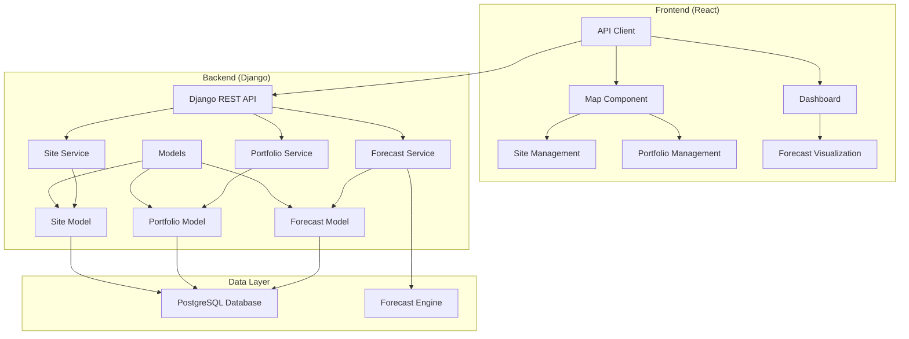

# Design Document

## Overview

The renewable resources forecasting application is designed as a full-stack web application with a Django backend providing REST APIs and a React frontend for user interaction. The system follows a modular architecture that separates concerns between site management, portfolio management, forecasting, and visualization components.

The application uses a map-based interface for intuitive site management and provides both real-time interaction and API-driven batch processing capabilities for forecasting operations.

## Architecture

### High-Level Architecture



### Technology Stack

- **Frontend**: React 18+ with TypeScript, Leaflet for mapping, Axios for API calls
- **Backend**: Django 4.2+ with Django REST Framework
- **Database**: PostgreSQL for production, SQLite for development
- **Mapping**: Leaflet with OpenStreetMap tiles
- **API**: RESTful APIs with JSON responses
- **Authentication**: Django's built-in authentication (extensible to JWT)

## Components and Interfaces

### Frontend Components

#### 1. Map Component (`MapView`)
- **Purpose**: Interactive map for site visualization and management
- **Props**: `sites`, `portfolios`, `onSiteAdd`, `onSiteSelect`
- **State**: `selectedSite`, `mapCenter`, `zoomLevel`
- **Features**: 
  - Click-to-add sites
  - Site markers with popup details
  - Portfolio grouping visualization

#### 2. Site Management (`SiteManager`)
- **Purpose**: CRUD operations for renewable energy sites
- **Props**: `selectedSite`, `onSiteUpdate`, `onSiteDelete`
- **State**: `editMode`, `formData`
- **Features**:
  - Site creation form
  - Site editing capabilities
  - Site deletion with confirmation

#### 3. Portfolio Management (`PortfolioManager`)
- **Purpose**: Create and manage site portfolios
- **Props**: `portfolios`, `sites`, `onPortfolioUpdate`
- **State**: `selectedPortfolio`, `availableSites`
- **Features**:
  - Portfolio creation/editing
  - Site assignment to portfolios
  - Portfolio visualization

#### 4. Forecast Dashboard (`ForecastDashboard`)
- **Purpose**: Display and manage forecasting results
- **Props**: `forecasts`, `portfolios`
- **State**: `selectedTimeRange`, `chartData`
- **Features**:
  - Forecast visualization charts
  - Portfolio forecast aggregation
  - Historical forecast data

### Backend Services

#### 1. Site Service
```python
class SiteService:
    def create_site(self, site_data: dict) -> Site
    def update_site(self, site_id: int, site_data: dict) -> Site
    def delete_site(self, site_id: int) -> bool
    def get_sites(self, filters: dict = None) -> List[Site]
    def get_site_by_id(self, site_id: int) -> Site
```

#### 2. Portfolio Service
```python
class PortfolioService:
    def create_portfolio(self, portfolio_data: dict) -> Portfolio
    def update_portfolio(self, portfolio_id: int, portfolio_data: dict) -> Portfolio
    def add_site_to_portfolio(self, portfolio_id: int, site_id: int) -> bool
    def remove_site_from_portfolio(self, portfolio_id: int, site_id: int) -> bool
    def get_portfolios(self) -> List[Portfolio]
    def get_portfolio_sites(self, portfolio_id: int) -> List[Site]
```

#### 3. Forecast Service
```python
class ForecastService:
    def trigger_portfolio_forecast(self, portfolio_id: int) -> ForecastJob
    def get_forecast_status(self, job_id: str) -> ForecastJobStatus
    def get_forecast_results(self, portfolio_id: int) -> ForecastResults
    def get_site_forecast(self, site_id: int) -> SiteForecast
```

### API Endpoints

#### Sites API
- `GET /api/sites/` - List all sites
- `POST /api/sites/` - Create new site
- `GET /api/sites/{id}/` - Get site details
- `PUT /api/sites/{id}/` - Update site
- `DELETE /api/sites/{id}/` - Delete site

#### Portfolios API
- `GET /api/portfolios/` - List all portfolios
- `POST /api/portfolios/` - Create new portfolio
- `GET /api/portfolios/{id}/` - Get portfolio details
- `PUT /api/portfolios/{id}/` - Update portfolio
- `DELETE /api/portfolios/{id}/` - Delete portfolio
- `POST /api/portfolios/{id}/sites/` - Add site to portfolio
- `DELETE /api/portfolios/{id}/sites/{site_id}/` - Remove site from portfolio

#### Forecasting API
- `POST /api/forecasts/portfolio/{id}/trigger/` - Trigger portfolio forecast
- `GET /api/forecasts/jobs/{job_id}/status/` - Get forecast job status
- `GET /api/forecasts/portfolio/{id}/results/` - Get portfolio forecast results
- `GET /api/forecasts/site/{id}/results/` - Get site forecast results

## Data Models

### Site Model
```python
class Site(models.Model):
    id = models.AutoField(primary_key=True)
    name = models.CharField(max_length=200)
    site_type = models.CharField(max_length=50, choices=[('solar', 'Solar'), ('wind', 'Wind')])
    latitude = models.DecimalField(max_digits=9, decimal_places=6)
    longitude = models.DecimalField(max_digits=9, decimal_places=6)
    capacity_mw = models.DecimalField(max_digits=10, decimal_places=2, null=True, blank=True)
    created_at = models.DateTimeField(auto_now_add=True)
    updated_at = models.DateTimeField(auto_now=True)
    
    class Meta:
        unique_together = ['latitude', 'longitude']
```

### Portfolio Model
```python
class Portfolio(models.Model):
    id = models.AutoField(primary_key=True)
    name = models.CharField(max_length=200)
    description = models.TextField(blank=True)
    sites = models.ManyToManyField(Site, through='PortfolioSite')
    created_at = models.DateTimeField(auto_now_add=True)
    updated_at = models.DateTimeField(auto_now=True)

class PortfolioSite(models.Model):
    portfolio = models.ForeignKey(Portfolio, on_delete=models.CASCADE)
    site = models.ForeignKey(Site, on_delete=models.CASCADE)
    added_at = models.DateTimeField(auto_now_add=True)
    
    class Meta:
        unique_together = ['portfolio', 'site']
```

### Forecast Models
```python
class ForecastJob(models.Model):
    id = models.UUIDField(primary_key=True, default=uuid.uuid4)
    portfolio = models.ForeignKey(Portfolio, on_delete=models.CASCADE)
    status = models.CharField(max_length=20, choices=[
        ('pending', 'Pending'),
        ('running', 'Running'),
        ('completed', 'Completed'),
        ('failed', 'Failed')
    ])
    created_at = models.DateTimeField(auto_now_add=True)
    completed_at = models.DateTimeField(null=True, blank=True)
    error_message = models.TextField(blank=True)

class ForecastResult(models.Model):
    id = models.AutoField(primary_key=True)
    job = models.ForeignKey(ForecastJob, on_delete=models.CASCADE)
    site = models.ForeignKey(Site, on_delete=models.CASCADE)
    forecast_datetime = models.DateTimeField()
    predicted_generation_mwh = models.DecimalField(max_digits=10, decimal_places=3)
    confidence_interval_lower = models.DecimalField(max_digits=10, decimal_places=3, null=True)
    confidence_interval_upper = models.DecimalField(max_digits=10, decimal_places=3, null=True)
    created_at = models.DateTimeField(auto_now_add=True)
```

## Error Handling

### Frontend Error Handling
- **Network Errors**: Display user-friendly messages with retry options
- **Validation Errors**: Show field-specific error messages in forms
- **Authentication Errors**: Redirect to login or show session expired message
- **Loading States**: Show spinners and skeleton screens during API calls

### Backend Error Handling
- **Validation Errors**: Return 400 with detailed field errors
- **Not Found**: Return 404 with descriptive error messages
- **Server Errors**: Return 500 with generic error message, log detailed errors
- **Forecast Errors**: Update job status to 'failed' with error details

### Error Response Format
```json
{
    "error": {
        "code": "VALIDATION_ERROR",
        "message": "Invalid input data",
        "details": {
            "latitude": ["This field is required"],
            "site_type": ["Invalid choice"]
        }
    }
}
```

## Testing Strategy

### Frontend Testing
- **Unit Tests**: Jest and React Testing Library for component testing
- **Integration Tests**: Test API integration with mock services
- **E2E Tests**: Cypress for critical user flows (site creation, portfolio management)
- **Visual Tests**: Snapshot testing for UI components

### Backend Testing
- **Unit Tests**: Django's TestCase for model and service testing
- **API Tests**: Django REST Framework's APITestCase for endpoint testing
- **Integration Tests**: Test database interactions and external service calls
- **Performance Tests**: Load testing for forecast API endpoints

### Test Coverage Goals
- Minimum 80% code coverage for backend services
- 70% coverage for frontend components
- 100% coverage for critical forecast engine logic

### Forecasting Engine Design

The forecasting system uses a pluggable architecture that allows different models to be easily integrated:

#### Model Interface
```python
class ForecastModel(ABC):
    @abstractmethod
    def predict(self, site: Site, forecast_horizon: int) -> List[ForecastPoint]:
        pass
    
    @abstractmethod
    def get_model_name(self) -> str:
        pass

class RandomForecastModel(ForecastModel):
    def predict(self, site: Site, forecast_horizon: int) -> List[ForecastPoint]:
        # MVP implementation using random number generation
        pass
    
    def get_model_name(self) -> str:
        return "Random Generator v1.0"
```

#### Model Registry
```python
class ModelRegistry:
    def __init__(self):
        self._models = {}
    
    def register_model(self, site_type: str, model: ForecastModel):
        self._models[site_type] = model
    
    def get_model(self, site_type: str) -> ForecastModel:
        return self._models.get(site_type, RandomForecastModel())
```

This design allows for easy integration of sophisticated forecasting models (weather-based, ML models, etc.) in future iterations while maintaining the same interface and API contracts.